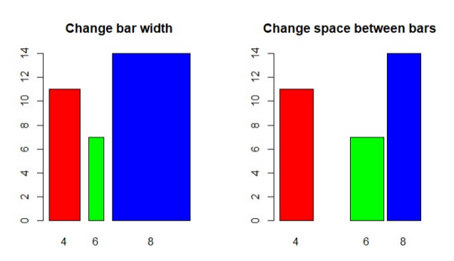

```{r 1.}
vectorA <- c(1, 2, 3, 4, 5)
matrixA <- matrix(0, nrow = 5, ncol = 5)


for (i in 1:5) {
  for (j in 1:5) {
    matrixA[i, j] <- abs(vectorA[i] - vectorA[j])
  }
}

matrixA
```
```{r asterisk}

for (i in 1:5){
    cat(rep("*",i), collapse = "\n")
    }

```

```{r 3}
calculate_fibonacci <- function(limit) {

  a <- 0
  b <- 1
  
  cat(a, " ")
  cat(b, " ")
  
  repeat {

    next_number <- a + b
    
    if (next_number > limit) {
      break  
    }
    
    cat(next_number, " ")
    
    a <- b
    b <- next_number
  }
}

user_input <- 1

if (!is.na(user_input) && user_input > 0) {
  calculate_fibonacci(500)
} else {
  cat("Invalid input. Please enter a valid positive number.\n")
}

#user_input value should've been as.numeric(readline("Enter the starting number for the Fibonacci sequence: ")) but I put a value so I can knit.
```
```{r 4.}
library(readxl)
HouseholdData <- read_excel("C:\\Users\\ASUS\\Documents\\Worksheet#4\\Worksheet#4\\HouseholdData.xlsx")
#View(HouseholdData)
```

```{r 4. b}
Femsubset <- subset(HouseholdData, Gender == "F")
Malesubset <- subset(HouseholdData, Gender == "M")
  
fRow <- nrow(Femsubset)
mRow <- nrow(Malesubset)
 
 
cat("Number of observations for Female:", fRow,"\n")
cat("Number of observations for Male:", mRow, "\n")
  
```

```{r 4. c}
sexCounts  <- c(fRow, mRow)
sexLabels <- c("Female", "Male")
plot <- barplot(sexCounts, names.arg = sexLabels,
                 main = "Number of Males and Females in Household Data",
                 xlab = "Sex", ylab = "Count",
                 col = c("pink", "lightblue"),
                 legend.text = sexLabels,
                 args.legend = list(x = "topright", bty = "n")
)

plot
```
```{r 5. piechart}
incomeDF <- data.frame(
  Expenses = c("Food", "Electricity", "Savings", "Miscellaneous"),
  Amount = c(60, 10, 5, 25)
)
incomeDF

pie(incomeDF$Amount, labels = incomeDF$Expenses, col = c("pink", "lightblue", "maroon", "purple"),
    main = "Distribution of Income")
```
```{r 6.a}
data("iris")

str("iris")
cat("The dataset iris is in character structure")
```
```{r 6.b}
mean_sep_length <- mean(iris$Sepal.Length)
mean_sep_width <- mean(iris$Sepal.Width)
mean_pet_length <- mean(iris$Petal.Length)
mean_pet_width <- mean(iris$Petal.Width)

mean_sep_length
mean_sep_width
mean_pet_length
mean_pet_width
```
```{r 6.c piechart}
species_chart <- table(iris$Species)
pie(species_chart, main = "Species Distribution in Iris Dataset",
    labels = c("Setosa", "Versicolor", "Virginica"),
    col = c("magenta", "violet", "purple"),
    clockwise = TRUE)
```
```{r 6.d}
subset_Setosa <- subset(iris, Species == "setosa")
subset_Versicolor<- subset(iris, Species == "versicolor")
subset_virginica <- subset(iris, Species == "virginica")

last6_setosa <-tail(subset(iris, Species == "setosa"))
last6_Versicolor <- tail(subset(iris, Species == "versicolor"))
last6_virginica <- tail(subset(iris, Species == "virginica"))

last6subsetSpeciesDF <- rbind(last6_setosa, last6_Versicolor, last6_virginica)
last6subsetSpeciesDF
```
```{r 6.e}
data(iris)
subiris <- iris[,1:2]

plot(subiris,
     pch = as.integer(iris$Species),
     col = as.integer(iris$Species)+9)
```

```{r 7.}
library(readxl)
alexa_file <- read_excel("C:\\Users\\ASUS\\Documents\\Worksheet#4\\Worksheet#4\\alexa_file.xlsx")
#View(alexa_file)
```

```{r factoring iris}
IrisFactor <- factor(iris$Species)   
IrisFactor
cat("This will display the character values of the species column and the levels")
```

```{r 7.a}
oldName = c("Black  Dot","Black  Plus","Black  Show","Black  Spot","White  Dot", "White  Plus", "White  Show", "White  Spot")
newName = c("Black Dot","Black Plus","Black Show","Black Spot","White Dot", "White Plus", "White Show", "White Spot")

alexa_file$variation <- gsub("Black  Dot","Black Dot",alexa_file$variation)
alexa_file$variation <- gsub("Black  Plus","Black Plus",alexa_file$variation)
alexa_file$variation <- gsub("Black  Show","Black Show",alexa_file$variation)
alexa_file$variation <- gsub("Black  Spot","Black Spot",alexa_file$variation)
alexa_file$variation <- gsub("White  Dot","White Dot",alexa_file$variation)
alexa_file$variation <- gsub("White  Show","White Show",alexa_file$variation)
alexa_file$variation <- gsub("White  Spot","White Spot",alexa_file$variation)
                   
alexa_file
```

```{r graphics}

```

```{r dplyr}
library("dplyr")
variationCount <- alexa_file %>%
count(variation)
variationCount
```

```{r variationData}
save(variationCount, file = "Variations.RData")

load("Variations.RData")
```

```{r loading}
blackVar <- variationCount[1:5,]
whiteVar <- variationCount[12:16,]

par(mfrow = c(1, 2))


barplot(blackVar$n, main = "Black Variants",
        xlab = "Variants",
        ylab = "Total Numbers",
        col = c("red", "orange", "yellow", "green", "navyblue"),
        names.arg = blackVar$variation,
        cex.names = 0.35) 


barplot(whiteVar$n, main = "White Variants",
        xlab = "Variants",
        ylab = "Total Numbers",
        col = c("red", "orange", "yellow", "green", "navyblue"),
        names.arg = whiteVar$variation,
        cex.names = 0.35) 

```